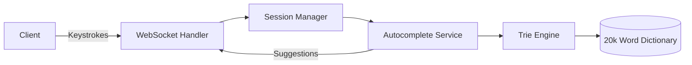

# Stateful Trie Autocomplete System

## Description

- AutoComplete Engine is Using tries under the hood to give suggestions based on prefix.
- Here Singelton pattern is Used for trie instance and Strategy for selection either prefix suggestion stateless or stateful prefix suggestion.
- Here in Stateful we keep track of keystrokes and move trie pointer accordingly theirby making traversal less costly.
- Implemented for a Dataset of Lower or Upper Character English alphabhets

## Features

- ⚡ **Stateful Trie traversal** - Maintains user session context for faster suggestions
- 🚀 **0.5ms average response time** (benchmarked with 20k words)
- 🔄 **Efficient backspace handling** - O(1) reverts to previous suggestions
- 🧩 **Extensible strategy pattern** - Easy to add new suggestion algorithms
- 🌐 **Real-time WebSocket API** - Streams suggestions per keystroke

## Tech Stack

| Component          | Technology               |
| ------------------ | ------------------------ |
| Backend            | Java 17, Spring Boot     |
| Data Structure     | Trie with stateful nodes |
| API Protocol       | WebSocket                |
| Session Management | ConcurrentHashMap        |
| Build Tool         | Maven                    |

## Architecture



## Getting Started

### Prerequisites

#### Java 17+

#### Maven 3.8+

#### WebSocket client (Postman v10+ or browser)

## Workflow

### 1 User types 'a'

```
{
"prefix": "a",
"suggestions": ["apple", "ant", "actor"],
"count": 3
}
```

### 2 User types 'c' (now 'ac')

```
{
  "prefix": "ac",
  "suggestions": ["actor", "active"],
  "count": 2
}

```

### 3 User presses backspace

```

{
  "prefix": "a",
  "suggestions": ["apple", "ant", "actor"],
  "count": 3
}
```
